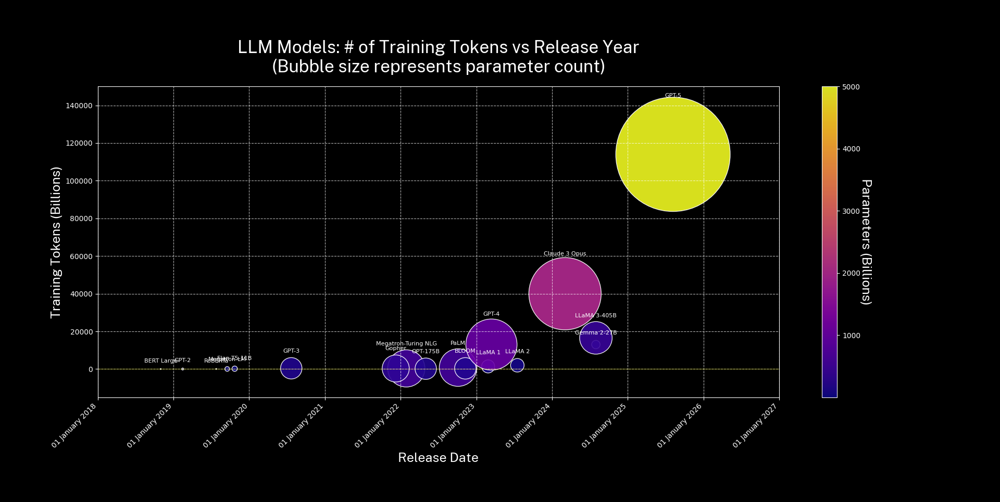

# LLM number of parameters and number of training tokens over time 

A data visualisation in `matplotlib` of the number of parameters in major LLMs as well as the number of tokens of text they were trained on. 

Used in my presentation _The Token Wars_, given at Everything Open 2025 Adelaide, and the Melbourne ML and AI Meetup April 2025. 

